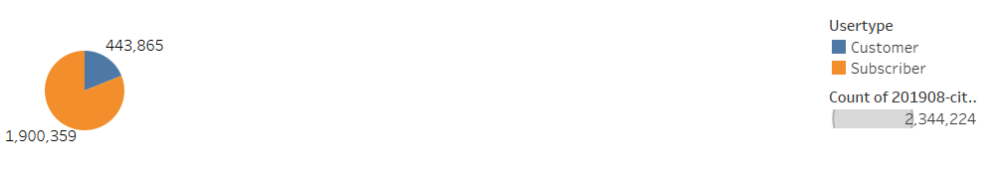
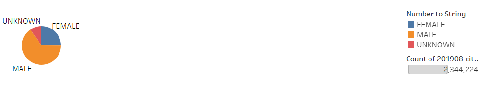
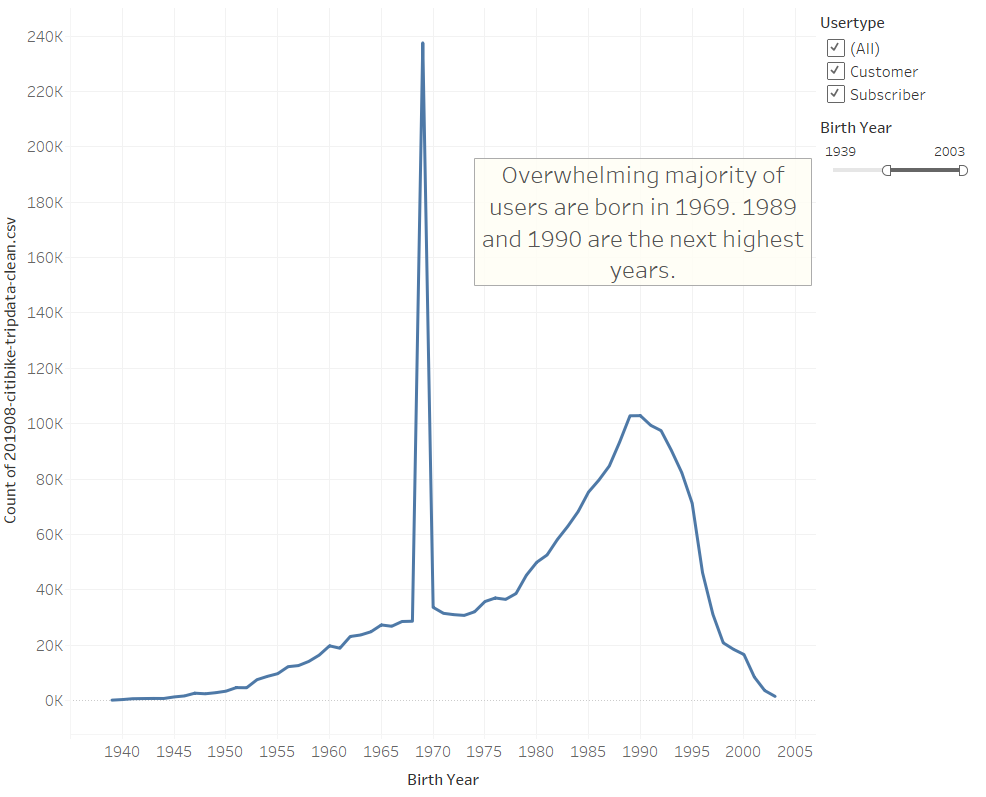
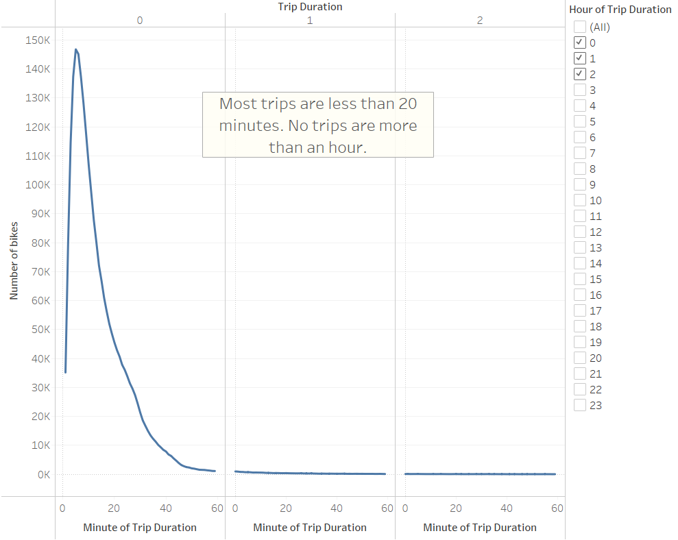
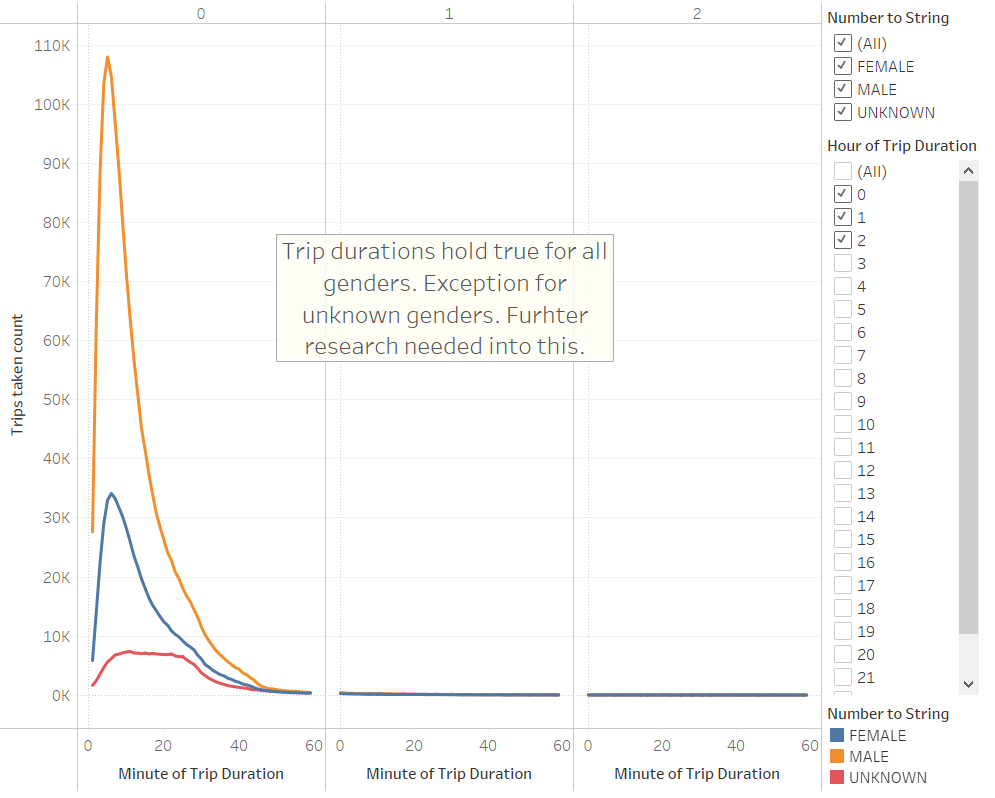
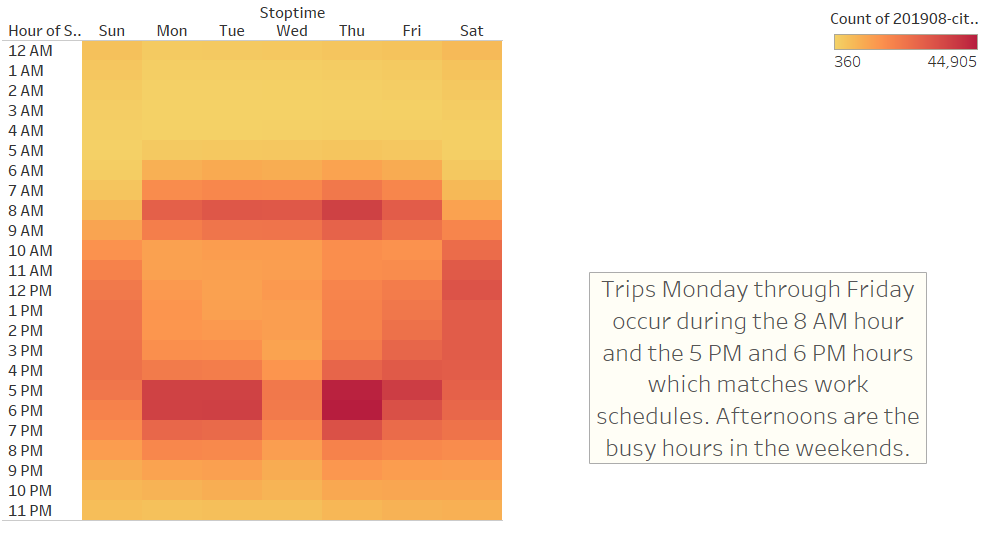
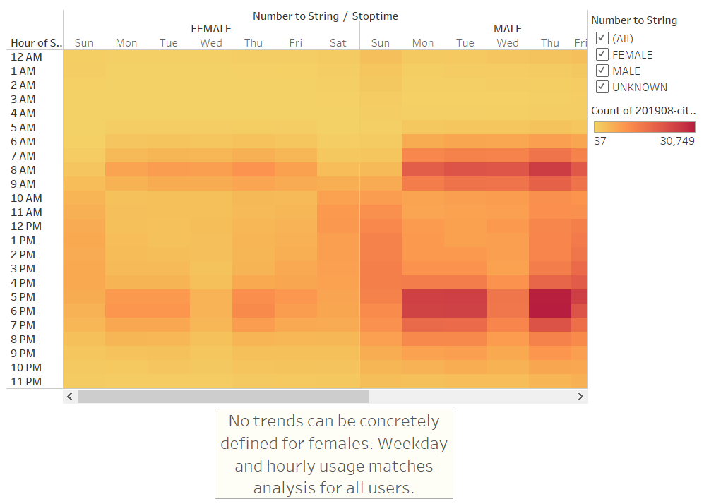
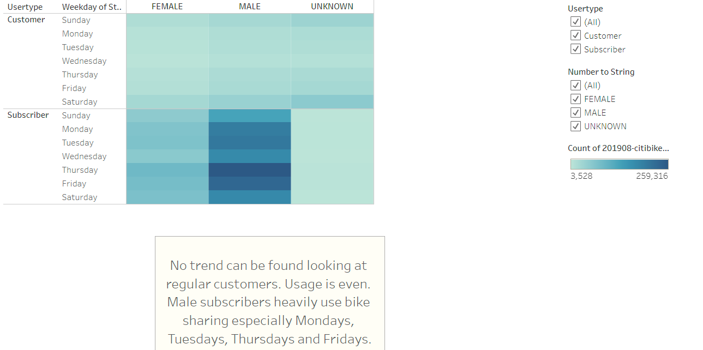

# Bike Sharing
## Overview
  This project utilies Tableau to determine if a bike sharing complany should invest in setting up bike sharing in Des Moines, IA. A variety of variables were considered using gender, times that bikes were used, days bikes are used, age of users and also a combination of these variables. A Tableau story was put together to present the facts so a descision can be made. This data is in reference to August of 2018 from New York City.
  ## Results
A huge number of users, 81%, are subscribers to the service. This is a positive as it shows that a base can be developed leading to funding to maintain and expand services and shows people like the service enough to become members.
    

    
Most of the users are males at 65%. 25 % are females.
    

    
Most of the users were born in 1969. The spike implies this could be an outliers. Perhaps birth year was entered incorrectly for some users. The users rises sharply for users born in the 1980s as well.
    

    
Users tend to ride the bikes around 10 minutes or so and declines sharply after that time period. There is virtually zero usage getting close to an hour. This analysis runs true across gender as well.
    

    
Looking at hourly usage across the week, the bikes are used mainly around working hours during the weekdays. Usage at 8 AM, 5 PM, 6 PM is very high. The afternoons on the weekends has moderate usage. This could also suggest post-working hours exercise. However, this only holds true for males. A trend cannot be found with females and hourly usage during the week.
    
   

    
No trends can be found at all for day usage when it comes to non-suscribed users even when looking at gender. For subscribers the data hold true for males in usage days for subscribers. Here we can see a slight trend with female subscribers and that trend shows higher usage on the same days as males.
    

    
  ## Summary
Tableau public link is posted below.

[link to dashboard](https://public.tableau.com/views/Bikesharing_16387606767810/DesMoinesBikesharingstory?:language=en-US&:display_count=n&:origin=viz_share_link)

Overall, we can see that users like the product and end up subscribing. Males overwhelmingly use the service around work times. Age wise users are middle-aged or millenials. However, there could be a reporting error and millenials look to be the more consistant generation of users. The demographics of Des Moines will weigh heavily in in bike sharing will be successful. There will need to be an alaysis consisting of Census data to determine if this will be a profitable move. I would also consider where the bikes are being used in New York to see if Des Moines can resemble the service is viable. For example, are the bikes used in recreational areas, shopping districts, and are they to areas that are mainly businesses that aren't retail. Another would be population density and traffic. New York has high density and traffic around the city is difficult to navigate which makes bikes a fantastic option. Finally, I would also look at public transportation and it's availabilty and usage. New York has plenty of public transportation and with the denisty sometimes it isn't the most viable. If this holds true in Des Moines or there is a lack of public traansportation this could be a wonderful opportunity.
